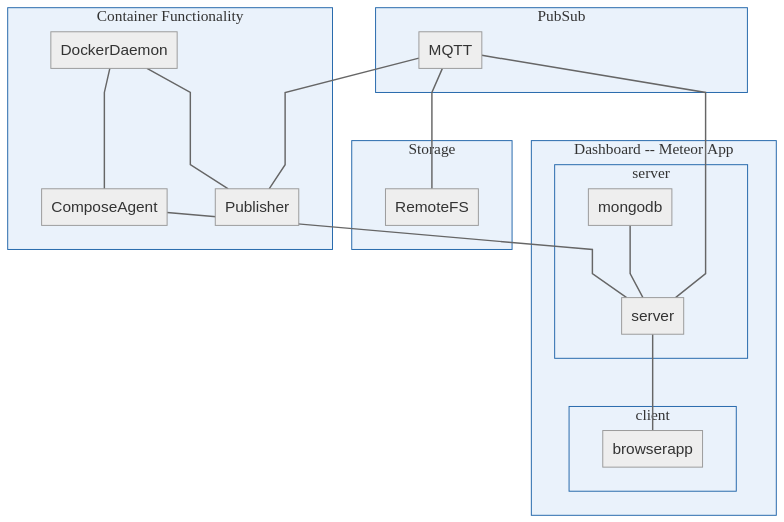
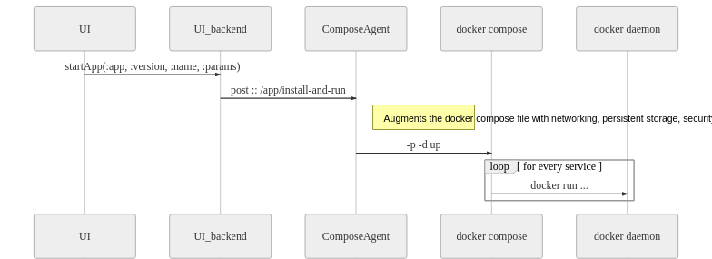
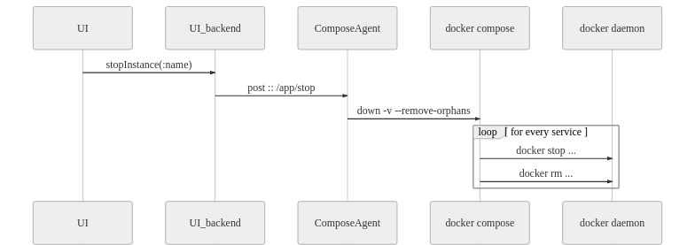
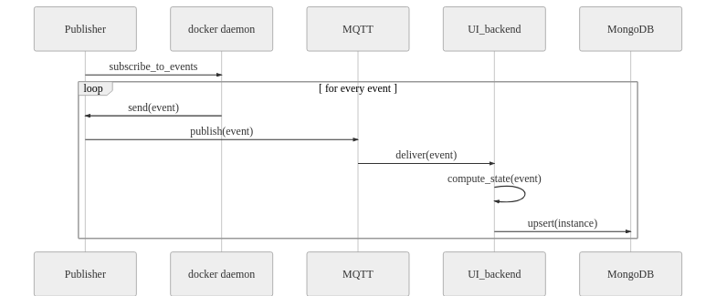

# Architecture

Docker-Dashboard is build on top of the Meteor application framework. Meteor is a homogenous framework, meaning that both client- and server-side code is written in JavaScript ( CoffeeScript). Furthermore Meteor takes care of distributing data
to clients. This makes it very easy to implement reactive single-page applications. Since the project was founded the development landscape has changed significantly. Docker-Dashboard started as a monolithic application. Over the years the project has adopted the following principles:

- Single Responsiblity (microservices)
- Single Integration Point (MQTT)

Currently Docker-Dashboard is transitioning to adopt a microservice architecture.

## Purpose
The primary goal of the Docker-Dashboard is;

- Ease of use for both technical and non-technical team members.

This goal is achieved by offering a user interface and an API. A non-technical user can start an application by one button click. The API can be used to automate deployments in a CI/CD pipeline.
Both interfaces abstract most of the Docker internals, thus reducing the implementation effort of a team.

## Functionality

## System Components

### Dashboard -- Meteor App
The dasboard (this repo) is internally made up of three components.
The client is a single page reactive web application delivered to client browsers. The client retrieves data from the server over [DDP](https://en.wikipedia.org/wiki/Distributed_Data_Protocol).
Persistent data is stored in a Mongo database. Because of the reactive nature of DDP and the Meteor app changes in data are automatically synchronised with clients.
The dashboard receives data from the different MQTT topics. The link from the dashboard to the ComposeAgent is technical debt. The dashboard uses the agents HTTP API to instruct it to start a new instance. This communication would have to be migrated to MQTT.

### MQTT
[MQTT](https://en.wikipedia.org/wiki/MQTT) is used as a publisher/subscriber (pubsub) mechanism. It's purpose is to connect all the sub-components. 

#### Topics

- /docker/events
- /docker/container/inspect
- /agent/docker/pulling
- /agent/docker/log/startup
- /agent/docker/log/startup/error
- /agent/docker/log/teardown
- /agent/storage/buckets
- /agent/storage/bucket/state
- /agent/storage/size
- /agent/storage/bucket/size
- /agent/docker/graph
- /network/info
- /docker/snapshot/containerIds
- /system/memory
- /system/cpu
- /system/uptime
- /errors/storage

### RemoteFS
RemoteFS manages the operations on storage Buckets. It ensures that bucket operations run local to the data. Furthermore it reports on the global disk usage.
See [RemoteFS Documentation](https://github.com/ICTU/remotefs/tree/master/docs).

### ComposeAgent
ComposeAgent is responsible for starting and stopping of instances. It translate these requests to Docker Compose commands. It restricts and enhances the Compose file for security and network purposes.
See [ComposeAgent Documentation](https://github.com/ICTU/docker-dashboard-agent-compose/blob/master/docs/README.md)

### Publisher
The publisher is responsible for retrieving state information of all running containers. It does so by querying the Docker daemon API.
See [Publisher Documentation](https://github.com/ICTU/publisher/tree/master/docs)

## Deployment concerns

TBD...

## System Functions
This chapter explains which internal system actions are triggered when using one of the public system functions.

### Start instance
Sequence of events when an instance is started through the UI or API.

### Stop instance
Sequence of events when an instance is stopped through the UI or API.

### State reconciliation
State information is constantly retrieved from the Docker daemon. Based on this information BigBoat updates its internal state about the instances.

