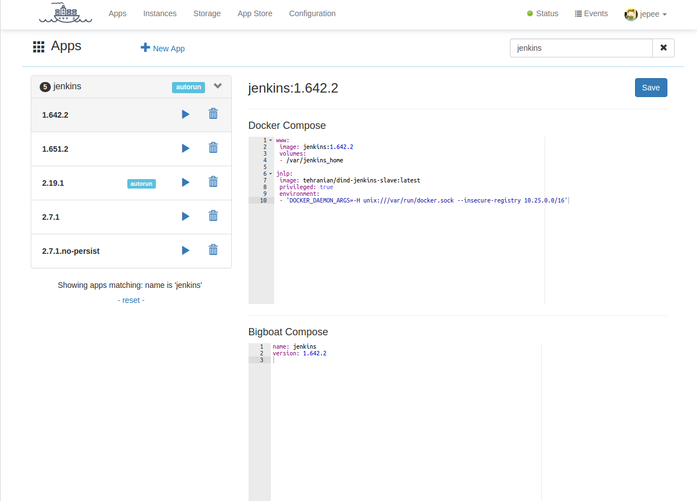

# Apps
[Application definitions](/apps) in **BigBoat** describe the different parts of your application and how they fit together. The application definition consists of two parts - a *Docker Compose* part and a *BigBoat Compose* part.



## Docker compose
The *Docker Compose* part of the application definition is for all engineering purposes what it says in the tin - a Docker Compose (version 1) file. However, not all Docker Compose features are allowed/supported and some work slightly differently than Docker Compose ran directly. There are also additional features, that **BigBoat** provides, that have no Docker Compose counterparts.

Example Docker Compose:
```
www:
  image: jenkins:2.7.1-alpine
  volumes:
    - /var/jenkins_home:/var/jenkins_home
  environment:
    - "JAVA_OPTS=-Duser.timezone=Europe/Amsterdam"
  mem_limit: 4g
  stop_signal: SIGKILL
```

## BigBoat compose
All BigBoat specific configuration resides here. The BigBoat Compose consists of application level properties and service level properties.

The application level properties are:

  - **name** - the name of the application
  - **version** - the version of the application
  - **tags** - list of application tags

The service level properties can be specified for each service in the Docker Compose and can be:

  - **enable_ssh** - **DEPRECATED**, please use **ssh**. Enables SSH connectivity to the container implementing this service
  - **ssh** - enables SSH connectivity to the container implementing this service. The value of this option is an object with the following attributes:
    - **shell** - (path to) the shell binary in the container; optional, defaults to *bash*. Set this attribute if for example there is no *bash* in the target container, i.e. in *alpine*-based containers.
    - **users** - login credentials; optional, defaults to empty list (no authentication is enforced). The users are specified as a YAML object where the keys are usernames and the values - passwords. For example:
    ```
      serviceName:
        ssh:
          shell: /bin/sh
          users:
            myself: secret-pass
            someone: 123456
    ```
    This option has a shortcut form:
    ```
      serviceName:
        ssh: true
    ```
    that provides unauthenticated *root* access using *bash* as a shell.
  - **endpoint** - the service endpoint; has the format of *:port/path* and will be used by BigBoat to provide a more meaningful link to your service
  - **protocol** - the service protocol; example *http,https,tcp,udp*.
  - **type** - the type of the service; possible values are *service* and *oneoff*; defaults to *service*.
  When set to *oneoff* BigBoat will not try to restart the service if it exits. The instance will enter *failing* state if the service exits with code other than *0*. If the type of the service is *service* (the default value) BigBoat will keep trying to restart the service container, exponentially backing away. The *oneoff* services are meant as a way to initialize/bootstrap other services in the application.
  - **startcheck** - A start check to be executed before any dependent services will be started. A *condition* will be run every *interval* with a *timeout* for a maximum *retries*. If the condition succeeds any dependent services will be started. After *retries* or a successful execution the startcheck will not be retried. The start check can be used to ensure that the service is in a certain state. The *condition* is mandatory, other properties have sensible defaults (timeout=5000, interval=1000, retries=10).

### Examples
  Example BigBoat Compose adding SSH connectivity to the www service:
  ```
  name: jenkins
  version: 2.7.1
  www:
      ssh: true
      endpoint: :8080/startScreen
      protocol: https
  ```

  Example BigBoat Compose with a startcheck

  ```
  name: nginx-with-startcheck
  version: 1.0

  www:
    startcheck:
      condition: wget http://localhost/
      timeout: 5000
      interval: 1000
      retries: 10
    ```
