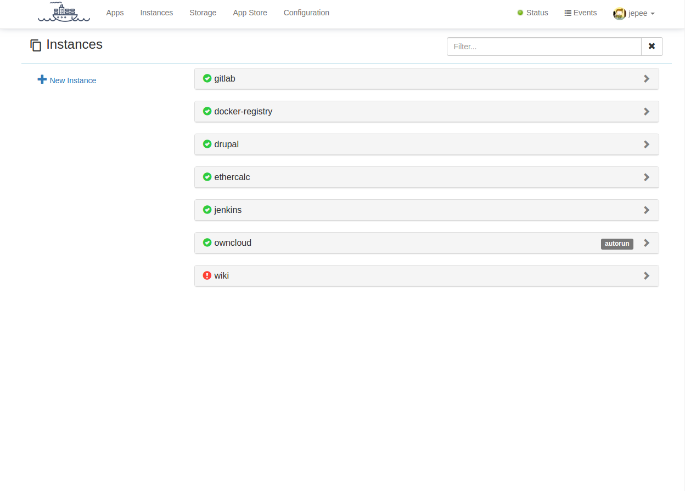

# Instances

Instances are running applications. One or more instances might be derived from
the same [App](application-definitions.md). Every instance has a unique instance name. This name is
used in the construction of the FQDN. An instance can be created from the Apps page.

## Storage Bucket

An instance can be associated with a Storage Bucket. The default selection
links the instance to a bucket with the same name as the instance.
If you wish you can link to a custom storage bucket. See [Storage](storage-buckets.md) to
find out more about storage options.
The second option is to not persist data. This means that the data will reside
inside the container, even though explicit volume mappings exist inside the
Docker Compose file. Data will **not** be retained between restarts of the Instance.
